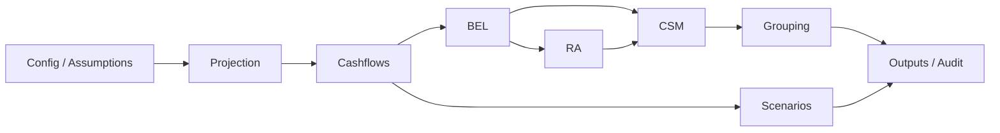

# Architecture Overview

This document describes the module responsibilities and end-to-end data flow for the IFRS 17 Term Life valuation engine.

The project follows a layered valuation engine design. Each layer has a clear responsibility and passes structured tabular outputs to the next stage. This keeps the model testable, auditable, and easy to challenge in review.

The architecture is intentionally portfolio-grade and educational. It is designed to demonstrate actuarial engineering practice and simplified IFRS 17 principles, not to act as a production IFRS 17 reporting system.

## Data Flow

## Module Responsibility Table

| Module | Responsibility | Key Outputs |
|---|---|---|
| assumptions/config | Load and validate configuration | Config object |
| projection | Create master data and policy-year projection | projection DataFrame |
| cashflows | Calculate cashflows and PV columns | PV cashflow columns |
| bel | Best Estimate Liability (liability-positive) | bel_results.csv, diagnostics |
| ra | Risk Adjustment | ra_results.csv |
| csm | Contractual Service Margin | csm_results.csv |
| grouping | IFRS 17-style grouping and onerous labels | group_results.csv |
| scenarios | Shocked runs for sensitivity analysis | scenario_results.csv |
| outputs/audit | Persist CSV/Excel/JSON and audit outputs | audit_report.json, bel_diagnostics.json |

## Layer Responsibilities

- Configuration defines assumptions and reproducibility settings.
- Projection expands policy records into policy-year rows.
- Cashflows calculate insurance inflows, outflows, reinsurance flows, expenses, and present values.
- BEL calculates policy-level liability-positive best estimate liability.
- RA calculates a simplified risk adjustment.
- CSM calculates initial margin, onerous loss, and simplified roll-forward outputs where used.
- Grouping assigns simplified IFRS 17-style portfolio, cohort, risk, and profitability groups.
- Scenarios run sensitivity shocks separately from the base valuation.
- Outputs and audit files persist reviewer-friendly evidence and reconciliation data.

## Notes

- BEL uses a liability-positive convention: BEL = PV(outflows) - PV(inflows).
- Diagnostics are optional and captured immediately after the base BEL calculation to avoid
  scenario overwrite risk.
- Scenario runs disable diagnostics by default.
- Outputs are designed for auditability and traceability, not regulatory reporting.
