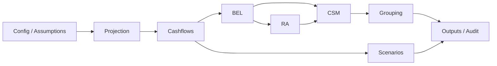
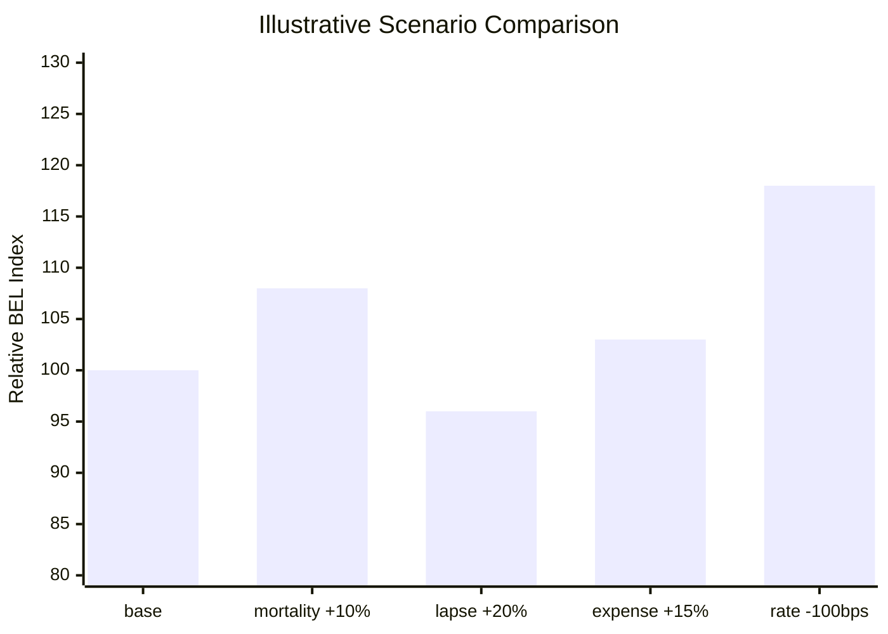

# IFRS 17 Term Life Valuation Engine

[](https://github.com/Thats-Zer/IFRS17_Term_Life_Engine/actions/workflows/ci.yml)

**A portfolio-grade IFRS 17 Term Life valuation engine built to be inspected, challenged, tested, and improved.**

This is a Python-based modular actuarial valuation engine for Term Life insurance under a
simplified IFRS 17 framework. It covers projection, cashflows, BEL, RA, CSM, grouping,
scenarios, reinsurance held, transition summaries, disclosure tables, and outputs/audit.

The project is a portfolio-grade CV project. It is intended to demonstrate actuarial
engineering, model governance awareness, auditability, and testable Python design. It is
not a production IFRS 17 system and is not a regulatory reporting tool.

The engine is a simplified but explainable IFRS 17 principles-aligned engine. Assumptions
are illustrative and not calibrated to insurer experience data. The default mortality
input uses a 1958 CSO mortality table; a future extension would include mortality, lapse,
expense, and premium calibration using real or publicly documented experience studies.

## Why This Repository Exists

IFRS 17 implementations are often difficult to inspect because production systems are
complex, proprietary, and heavily governed. This repository takes the opposite approach:
it is an educational and configurable valuation sandbox.

Users can change assumptions through `config/config.json`, run the engine, inspect
intermediate outputs, and challenge how assumptions flow through projection, cashflows,
BEL, RA, CSM, grouping, scenarios, diagnostics, and audit files.

The goal is not to provide a production IFRS 17 system. The goal is to make the core mechanics visible, testable, and easier to discuss.

## What This Project Is

- A portfolio-grade actuarial engineering project
- A simplified IFRS 17 Term Life valuation engine
- A modular Python valuation framework
- A learning-oriented and challengeable model
- A configurable educational IFRS 17 valuation sandbox
- A demonstration of model governance and auditability
- A reviewer-friendly demo of calibration, reinsurance held, transition, and disclosure summaries

## What This Project Is Not

- Not a production IFRS 17 system
- Not a regulatory reporting tool
- Not official accounting or actuarial advice
- Not a replacement for company-grade IFRS 17 models
- Not calibrated to real company data by default

## Quickstart

Windows PowerShell:

```powershell
git clone https://github.com/Thats-Zer/IFRS17_Term_Life_Engine.git
cd IFRS17_Term_Life_Engine
python -m venv .venv
.\.venv\Scripts\python.exe -m pip install -r requirements.txt
.\.venv\Scripts\python.exe -m pip install -r requirements-dev.txt
.\.venv\Scripts\python.exe main.py
```

Run tests:

```powershell
.\.venv\Scripts\python.exe -m pytest
```

Open the notebook walkthrough:

```text
notebooks/demo_walkthrough.ipynb
```

Run quality checks:

```powershell
.\.venv\Scripts\python.exe -m ruff check scripts tests main.py engine model
.\.venv\Scripts\python.exe -m black --check scripts tests main.py engine model
.\.venv\Scripts\python.exe -m mypy engine model main.py
```

## Architecture

The project follows a layered valuation engine design. Each stage produces structured
tabular outputs that can be inspected, reconciled, tested, and challenged.



See [`docs/architecture.md`](docs/architecture.md) for detailed architecture notes.

## Technical Highlights

- **Pydantic config validation** for assumptions and model settings
- **Pandas / NumPy** calculation layer for projection and valuation tables
- **pytest** validation suite for core mechanics and regression checks
- **GitHub Actions CI/CD** for automated quality gates
- **Ruff / Black / Mypy** for linting, formatting, and static type checks
- **pytest-cov coverage tracking**, with a documented target of **90%+**
- **Benchmark tooling** through `scripts/benchmark_engine.py`
- **Sample data validation** for optional external policy input
- **Audit JSON outputs** including assumption snapshots, audit reports, and run metadata
- **BEL diagnostics** for explainability and reconciliation review
- **Disclosure package helpers** for summary, group, scenario, transition, and reinsurance held views
- **Experience calibration helper** for credibility-weighted assumption multipliers

## BEL Diagnostics and Audit Outputs

BEL uses a liability-positive convention:

```text
BEL = PV(outflows) - PV(inflows)
```

The BEL output includes a per-policy breakdown of present value outflows and inflows,
including claims, surrender benefits, expenses, reinsurance ceding, reinsurance recovery,
counterparty default cost, premiums, and death benefits.

The core reconciliation is:

```text
bel_per_policy = pv_bel_outflows - pv_bel_inflows
```

The engine writes audit-oriented JSON outputs:

- `bel_diagnostics.json`: BEL diagnostic summary for reviewer inspection
- `audit_report.json`: assumption hash, row counts, reconciliation totals, diagnostics, and run metadata
- `data_validation_report.json`: structured input and intermediate-table validation findings

Base BEL diagnostics are captured explicitly after the base BEL calculation and passed to
the output layer. Scenario runs disable diagnostics by default so the base diagnostic
summary is protected from scenario overwrite risk.

## Demo and Sample Run

The repository includes a notebook walkthrough in [`notebooks/demo_walkthrough.ipynb`](notebooks/demo_walkthrough.ipynb). It uses the valuation engine with a small configurable portfolio and can be used to inspect:

- BEL, RA, CSM, and onerous loss metrics
- PV inflow / outflow / net cashflow line charts
- Scenario comparison bar charts
- IFRS 17-style grouping output
- Reinsurance held and transition summary tables
- Disclosure summary tables
- BEL diagnostic JSON for audit review

Curated example outputs for reviewer inspection are provided under [`examples/default_outputs`](examples/default_outputs).

## Default Example Outputs

Tracked curated/truncated example outputs are available under [`examples/default_outputs`](examples/default_outputs) for reviewer inspection. Running `main.py` writes full fresh runtime outputs to `outputs/`, which is ignored by Git because those files change on each run.



## Sample Data and Data Lineage

Sample synthetic data is provided under `data/sample`:

- `data/sample/sample_policies.csv`
- `data/sample/sample_mortality_table.csv`
- `data/sample/sample_config.json`

The sample dataset is synthetic and designed for inspection and reproducibility. The
engine can optionally load external policy input through `sample_policy_path` in the
config.

Input validation checks required fields, unique policy IDs, non-negative sum assured,
valid issue ages, positive coverage years, missing values, infinite values, mortality
rates, lapse rates, and discount factors. A structured data validation report is written
to `outputs/data_validation_report.json` for reviewer inspection.

Data lineage is covered in [`docs/methodology.md`](docs/methodology.md) and
[`docs/architecture.md`](docs/architecture.md).

## Advanced Demonstration Layers

The project includes small, inspectable modules for topics that would be much larger in a production IFRS 17 implementation:

- `engine/calibration.py`: credibility-weighted mortality, lapse, and expense multipliers from experience data
- `engine/reinsurance.py`: simplified reinsurance held BEL / RA / CSM view
- `engine/transition.py`: compact transition summary for full retrospective, modified retrospective, or fair-value-style review
- `engine/disclosures.py`: reviewer-friendly disclosure package tables

These modules are intentionally transparent and testable. They demonstrate the direction of production concepts without claiming to replace a formally governed insurer implementation.

## Performance Benchmark

An optional benchmark script is available:

```powershell
$env:PYTHONPATH='.'
.\.venv\Scripts\python.exe scripts\benchmark_engine.py --policies 10000 50000 --projection-years 10
```

Benchmarks are machine-dependent and should be interpreted as local performance observations, not certified production performance.

| Policies | Projection Years | Runtime | Peak Memory | Notes |
|----------|------------------|---------|-------------|-------|
| 10,000 | 10 | 14.92s | 136.92 MB | Local benchmark |
| 50,000 | 10 | 67.95s | 683.84 MB | Local benchmark |
| 100,000 | 10 | 136.34s | 1367.60 MB | Optional large run |

## Challenge This Project

This project is intentionally inspectable and challengeable. Reviewers are invited to
question the model design and implementation, especially:

- BEL convention
- Timing assumptions
- RA methodology
- CSM treatment
- Grouping logic
- Scenario assumptions
- Diagnostics
- Tests
- Architecture

The goal is not to claim production-level IFRS 17 compliance. The goal is to make the
actuarial logic and engineering choices visible enough to be reviewed, debated, and
improved.

## Limitations

See [`docs/model_limitations.md`](docs/model_limitations.md) for the full limitations statement.

Key limitations:

- Simplified IFRS 17 framework
- Not production-ready
- Not suitable for regulatory reporting
- Synthetic/sample data by default
- Illustrative assumptions unless replaced; not calibrated to insurer experience data by default
- Simplified RA, CSM, grouping, and reinsurance treatment
- Full transition mechanics are not implemented unless explicitly present
- PAA, VFA, and GMM distinctions may be simplified

## Suggested CV Description

**English:**

Developed a portfolio-grade IFRS 17 Term Life valuation engine in Python, designed as a
transparent and challengeable actuarial engineering project with modular BEL/RA/CSM
calculations, scenario analysis, diagnostics, reconciliation checks, and audit-ready JSON
outputs.

**Turkish:**

Python ile portfolio-grade bir IFRS 17 Term Life valuation engine geliştirdim. Proje;
BEL/RA/CSM hesaplamaları, senaryo analizleri, reconciliation kontrolleri, diagnostic
raporlar ve audit-ready JSON çıktılarıyla incelenebilir ve geliştirilebilir bir
aktüeryal mühendislik çalışması olarak tasarlandı.

## Roadmap

- Coverage beyond current 90%
- Streamlit demo enhancements
- Richer coverage units
- Assumption unlocking
- Cohort-level CSM
- Expanded RA methodology, including confidence-level and cost-of-capital alternatives
- Real or publicly documented experience study calibration for mortality, lapse, expense, and premium assumptions
- Benchmark results
- Deeper data lineage documentation
- Formal financial statement disclosure package

## Documentation

- [`docs/architecture.md`](docs/architecture.md)
- [`docs/methodology.md`](docs/methodology.md)
- [`docs/model_limitations.md`](docs/model_limitations.md)
- [`docs/coverage_plan.md`](docs/coverage_plan.md)
- [`DOCUMENTS/ACTUARIAL_METHODOLOGY_VALIDATION_REPORT.md`](DOCUMENTS/ACTUARIAL_METHODOLOGY_VALIDATION_REPORT.md)
- [`notebooks/demo_walkthrough.ipynb`](notebooks/demo_walkthrough.ipynb)

## License

This project is licensed under the **GNU Affero General Public License v3.0 or later (AGPL-3.0-or-later)**.

License summary:

- Current license: AGPL-3.0-or-later
- Commercial licensing may be available upon request
- Earlier Apache-2.0 copies are historical only
- This is not production IFRS 17 / regulatory reporting / legal or actuarial advice

SPDX identifier:

```text
AGPL-3.0-or-later
```

Commercial licensing may be available upon request. If you want to use this project in a proprietary, closed-source, commercial, or hosted/SaaS context without complying with AGPL obligations, please contact the author to discuss a separate commercial license.

Earlier public copies of this repository may have been available under Apache-2.0. The current version is licensed under AGPL-3.0-or-later. This licensing change does not revoke rights that were already granted for those earlier copies.

This repository is an educational / portfolio-grade actuarial engineering project. It is not a production IFRS 17 system, not a regulatory reporting tool, and not official actuarial, accounting, legal, or financial advice.

Unless explicitly stated otherwise, branding, logos, screenshots, presentation materials, and non-code assets are not granted for unrestricted commercial reuse.

## Licensing of non-code assets

Unless explicitly stated otherwise:

- Source code is licensed under AGPL-3.0-or-later.
- Documentation, methodology notes, synthetic portfolios, screenshots, demo materials, and other non-code assets may be subject to separate restrictions and are not granted for unrestricted commercial reuse.
- Extended Excel reconciliation templates, commercial reporting packs, proprietary adapters, and high-performance components are not included in the open-source license unless explicitly stated and may require separate permission or a commercial agreement.
